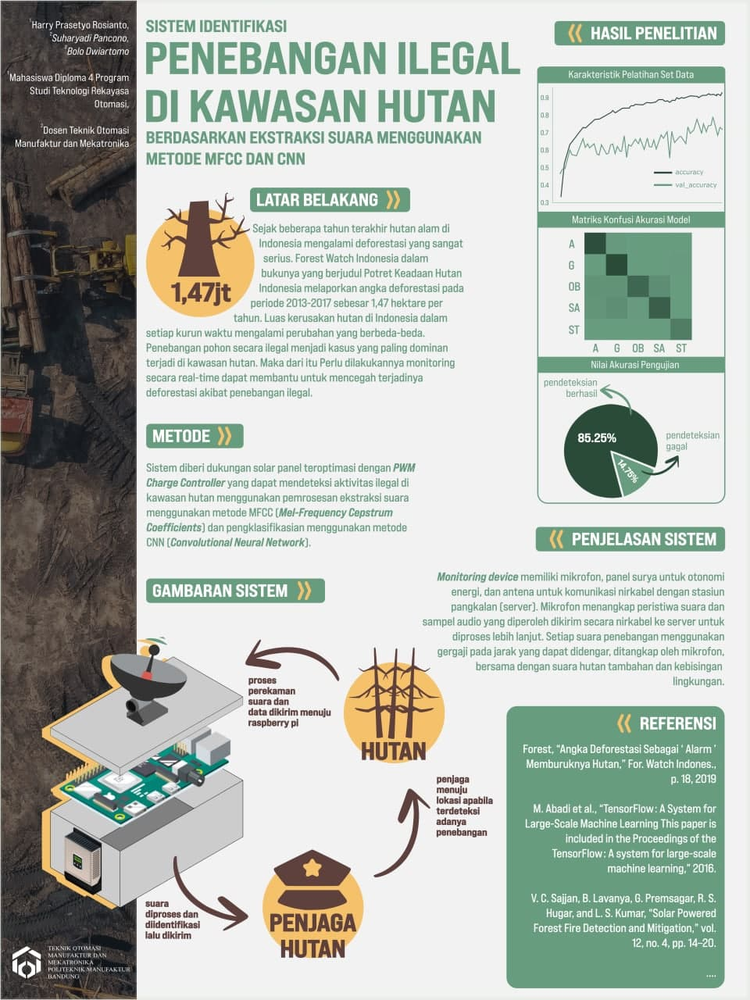
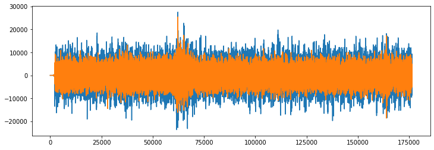
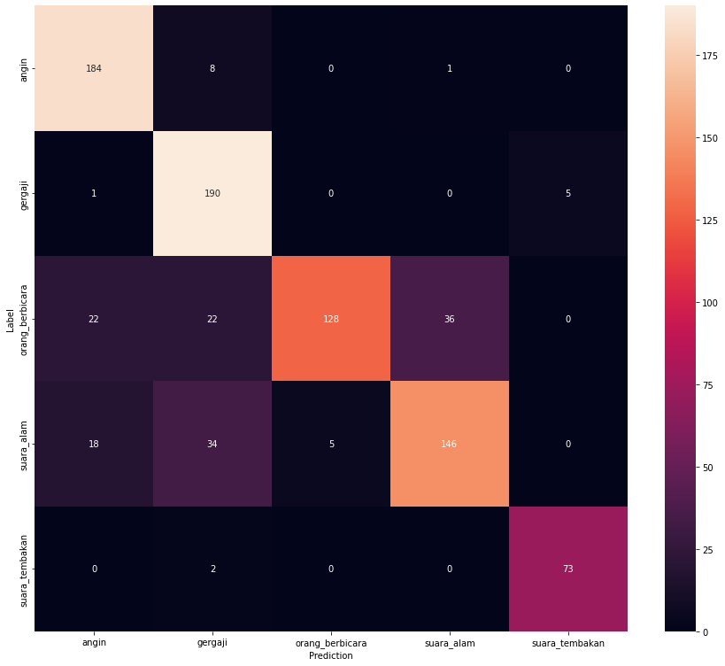

# ILD-Prototype
a Final Project for Illegal Logging Detection using Raspberry Pi 4 Model B with MFCC and CNN method

### Prerequisites

Function dependencies used in this project:

- Keras 2.3.1
- numpy 1.17.5
- pandas 1.3.5
- scipy 1.7.3
- tensorflow 2.3.0
- librosa 0.7.2
- azure-storage-blob 2.1.0

### Classes
At this time, only 5 classes will be picked for the Illegal Logging Detection using Raspberry Pi
`gergaji` `suara_tembakan` `angin` `suara_alam` `orang_berbicara`

### Audio Processing
Data generation involves producing raw PCM wavform data containing a desired number of samples and at fixed sample rate and the following configuration is used

| Samples        | Sample Rate           | Clip Duration (ms)  |
| ------------- |:-------------:| -----:|
| 22050      | 22050 | 4000 |

| Original Bit Depth     | Librosa Bit Depth  |
| --- | --- |
| min: 4 | min: -0.5 |
| max: 32 | max: 0.75 |

- Original Channel

- Channel Merged

### Built With

* [Keras](https://keras.io/) - Deep Learning Framework
* [TensorFlow](http://tensorflow.org/) - Machine Learning Library
* [Librosa](http://librosa.org/) - Python Audio Package

### Hardware
- Raspberry Pi 4 Model B (8GB) / Raspberry Pi 3 Model B (1GB)
- Microphone wired portable
- Solar Charge Controller (with Arduino)
- Solar Cell (20W)

### Results
After the training the model for 75 epochs, the following confusion matrix was generated for assessing classification performance.

